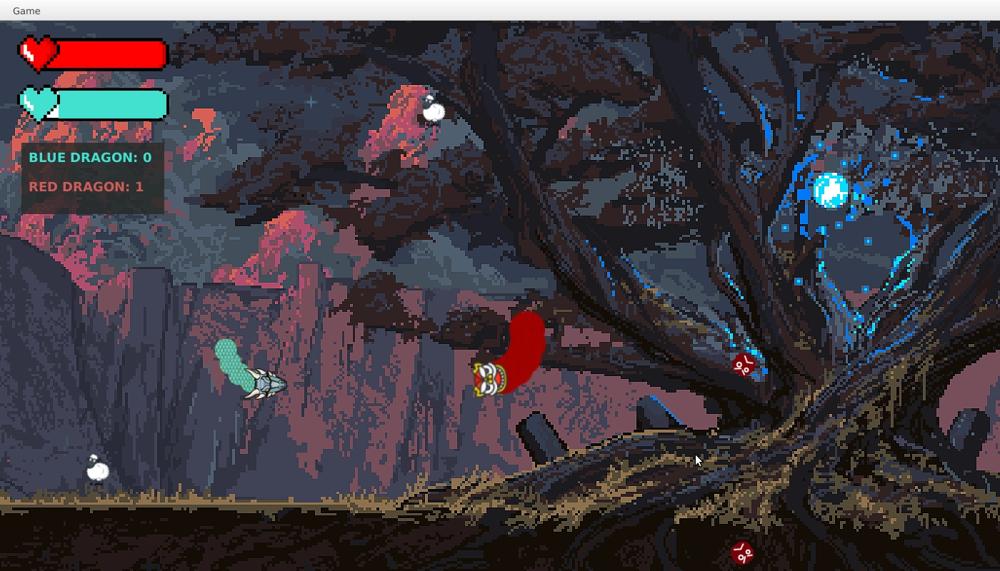

# Snake game

## Description

Online web-application written in Java, using Maven, Java Servlets, PostgreSQL and JUnit,
where users can browse products, add them into a shopping cart, checkout items and
make payments.

## Development

### Inside IntelliJ Idea

   Open the project as a Maven project. (by opening the pom.xml)

   Run it from the maven sidebar by running 
   
    javafx:run <target>

### From command line

   Build it with

   ``` 
   mvn javafx:compile
```
    

   Run in with

   ```
mvn javafx:run
```
    

### The implementation

